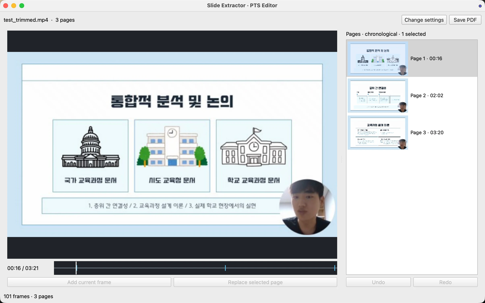

<div align="center">

# Slide Extractor

**강의 영상에서 슬라이드를 찾고, 필요한 페이지만 PDF로.**

[](https://github.com/juhwan0628/slide-extractor-gui/actions/workflows/ci.yml)
[](https://github.com/juhwan0628/slide-extractor-gui/releases)


[베타 다운로드](#다운로드) · [사용법](#사용법) · [릴리스](https://github.com/juhwan0628/slide-extractor-gui/releases) · [문제 제보](https://github.com/juhwan0628/slide-extractor-gui/issues)

</div>



<sub>직접 제작한 발표 영상을 실제 앱으로 분석한 Mac 화면입니다. OS에 따라 창과 버튼 모양이 다를 수 있습니다.</sub>

## 영상에서 PDF까지

**영상 열기 → 슬라이드 분석 → 페이지 편집 → PDF 저장**

- **로컬 처리:** 영상 분석과 PDF 생성은 내 기기에서 수행합니다. 클라우드 업로드나 계정 로그인 없이 사용합니다.
- **확인하고 편집:** 타임라인과 썸네일로 이동하면서 누락된 페이지를 추가하고, 중복 페이지를 제거하거나 대표 프레임을 바꿉니다.
- **CPU 최적화:** 멀티스레드와 프레임 메타데이터를 기본으로 활용합니다. 별도 GPU가 필요하지 않습니다.
- **같은 앱, 두 OS:** 공통 Python·Qt 소스로 Apple Silicon Mac과 Windows x64 설치 파일을 만듭니다.
- **출력 선택:** 기본은 PDF 단독 저장이며, 고급 설정에서 타임스탬프 JSON을 함께 저장할 수 있습니다.

## 다운로드

현재 버전은 **0.4.10rc2 베타**입니다. 두 OS의 설치·분석·PDF 저장 검사를 GitHub Actions에서 통과했습니다. MIT 및 제3자 고지·대응 소스 자료는 릴리스에 함께 제공합니다.

| 기기 | 설치 파일 | 누적 다운로드 | 설치 안내 |
|---|---|---|---|
| Apple Silicon Mac | [DMG 다운로드](https://github.com/juhwan0628/slide-extractor-gui/releases/download/v0.4.10rc2/SlideExtractor-v0.4.10rc2-macOS-arm64.dmg) |  | [Mac 설치](INSTALL-MAC.md) |
| Windows x64 | [설치 EXE 다운로드](https://github.com/juhwan0628/slide-extractor-gui/releases/download/v0.4.10rc2/SlideExtractor-v0.4.10rc2-Setup-Windows-x64.exe) |  | [Windows 설치](INSTALL-WINDOWS.md) |

다운로드 수는 공개된 모든 버전의 설치 DMG·EXE 누적 다운로드 횟수입니다. 재다운로드를 포함하며 사용자 수나 설치 횟수를 뜻하지 않습니다. 소스·라이선스 ZIP은 제외하고 약 1시간마다 자동 갱신합니다.

일반 사용자는 위 설치 파일 하나만 받으면 됩니다. [대응 소스·라이선스·검증 자료 ZIP](https://github.com/juhwan0628/slide-extractor-gui/releases/download/v0.4.10rc2/SlideExtractor-v0.4.10rc2-Sources-Licenses.zip)은 개발·라이선스 확인용이며 설치에 필요하지 않습니다.

GitHub Releases에서 설치 파일을 직접 다운로드합니다. **Python·Qt·FFmpeg·FFprobe는 포함돼 있습니다.** Intel Mac과 Windows ARM은 이번 베타 검증 대상이 아닙니다.

베타는 유료 코드 서명·Apple 공증을 적용하지 않았으므로 OS 경고나 실행 차단이 발생할 수 있습니다. 자세한 내용은 각 OS 설치 안내를 참고하세요.

## 사용법

1. **Open video**로 영상을 열고 자동으로 제안된 슬라이드 영역을 확인합니다.
2. 필요하면 **Slide ROI**로 영역을 조절하고, **Ignore mask**로 웹캠 등 변화 감지에서 제외할 영역을 지정합니다.
3. **Analyze**로 분석한 뒤 타임라인과 페이지 목록에서 추가·교체·병합·삭제합니다.
4. **Save PDF**로 저장합니다.

[사진으로 보는 자세한 사용법](docs/USAGE.md)

빠른 슬라이드 전환이나 특이한 화면 구성은 자동 분석에서 누락될 수 있으니 저장 전에 페이지를 확인하세요.

### 페이지 편집 단축키

페이지 목록에 포커스가 있을 때 작동합니다. Mac은 Ctrl 대신 Cmd를 사용합니다.

| 작업 | Windows | Mac |
|---|---|---|
| 전체 선택 | Ctrl+A | Cmd+A |
| Merge · 마지막 페이지 유지 | Ctrl+M | Cmd+M |
| 선택 페이지 삭제 | Delete / Backspace | Delete / Backspace |
| 실행 취소 | Ctrl+Z | Cmd+Z |
| 다시 실행 | Ctrl+Shift+Z / Ctrl+Y | Cmd+Shift+Z |

실행 취소는 최대 100회이며 선택·포커스·프리뷰 위치도 복원합니다. 새 영상을 열거나 새 분석 결과를 적용하면 편집 이력이 초기화됩니다.

필기가 누적되거나 같은 페이지를 재방문하는 영상은 수동 Merge로 정리할 수 있습니다. 자동 필기·재방문 처리 개선은 향후 연구 과제로 남겨두며 이번 버전의 변화 감지 알고리즘은 유지합니다.

## 이번 베타의 변경

- Shift 범위 선택, Ctrl/Cmd 개별 선택과 선택 개수 표시.
- 선택 페이지 일괄 Merge·삭제, 선택과 프리뷰까지 복원하는 Undo/Redo.
- 페이지 목록 전용 키보드 단축키와 편집 후 PDF·JSON 저장 검사.
- 분석·PDF 생성 성능 개선과 Windows 콘솔 깜빡임·저장 오류 수정.
- PDF 단독 저장 후 남던 `.lock` 수정: 정상 저장, 덮어쓰기, 게시 실패, 취소 시 잠금을 정리합니다.
- 실제 설치된 Mac·Windows 앱에서 PDF와 PDF+JSON 저장 및 출력 잠금 정리 검사.
- MIT 라이선스와 앱 내 About / Licenses 안내, 이미지 전용 OpenCV 빌드 및 대응 소스 제공.

[릴리스 노트](RELEASE_NOTES.md) · [검증 기록](packaging/QA_STATUS.md)

## 개발과 기여

기존 CLI [slide-extractor](https://github.com/juhwan0628/slide-extractor)와 별도 프로젝트입니다. 사용자는 설치 파일을 사용하고, 개발자는 아래 절차로 실행합니다.

Python 3.12와 FFmpeg/FFprobe가 필요합니다.

```bash
python3 -m venv .venv
.venv/bin/python -m pip install -r requirements.txt
.venv/bin/python app.py
```

Windows에서는 `.venv\Scripts\python.exe`를 사용합니다.

<details>
<summary>테스트 실행과 저장소 구조</summary>

```bash
python -m pip install -r requirements-dev.txt
python -m pytest -q
```

화면 없는 Linux 환경은 `QT_QPA_PLATFORM=offscreen PYTHONPATH=. python -m pytest -q`를 사용합니다.

| 경로 | 역할 |
|---|---|
| `gui/` | 공통 Qt 화면과 작업 관리 |
| `slide_core/` | 분석·편집·캐시·PDF 저장 |
| `tests/` | 기능·실패·취소·동시성 회귀 검사 |
| `packaging/` | 버전 고정, 앱 패키징과 배포 자료 검증 |
| `.github/workflows/` | 공통 테스트와 맥·Windows 빌드 |
| `docs/images/` | README용 실제 앱 화면 |

테스트 영상은 합성 데이터로 생성합니다. 강의 원본·추출 교안·사용자 출력·빌드 결과는 저장소에 포함하지 않습니다. `tests/`는 개발 소스로 유지하며 사용자 설치 파일에 복사하지 않습니다.

</details>

[동시 배포 절차](RELEASING.md) · [개인용 개발 빌드](packaging/BUILD_PERSONAL.md)

## 이용과 라이선스

처리 권한이 있는 로컬 영상을 입력해 사용하세요. 강의 영상이나 교안은 이 저장소에서 배포하지 않습니다.

앱 코드는 [MIT 라이선스](LICENSE)로 공개합니다. 제3자 의존성의 라이선스는 별도로 적용됩니다. [고지](THIRD_PARTY_NOTICES.md) · [배포 자료 검토](LICENSE_AUDIT.md)
