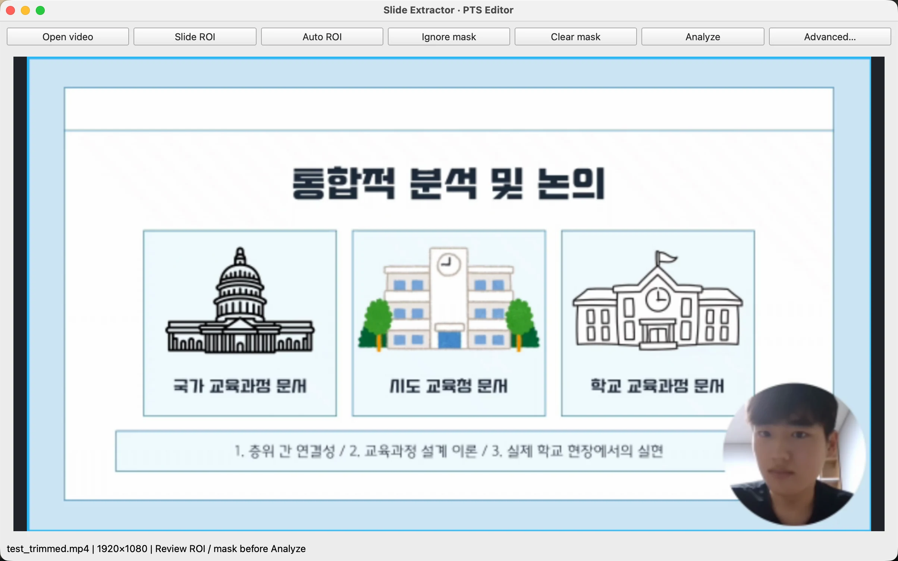
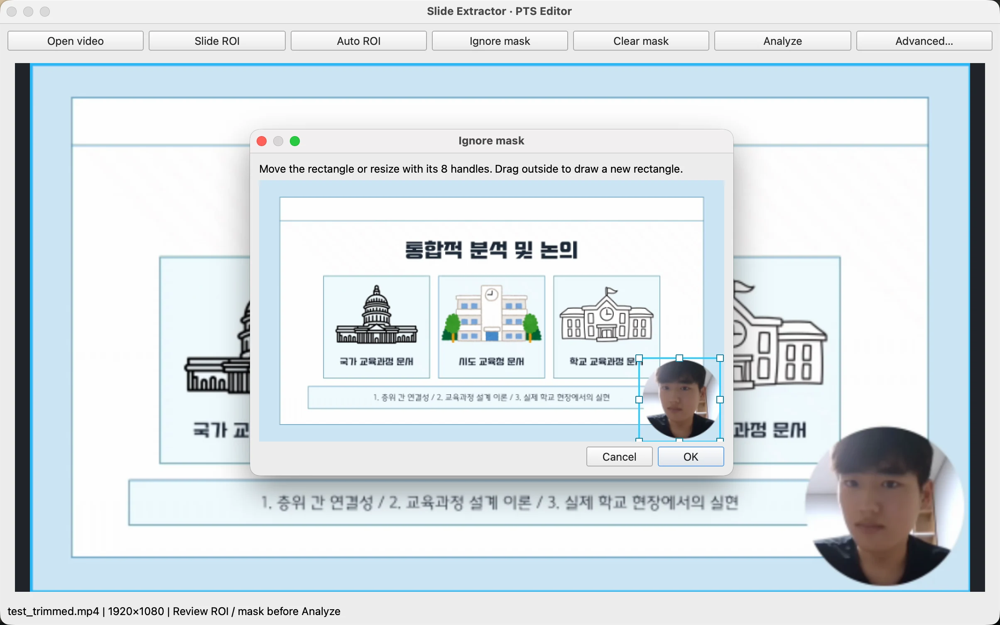
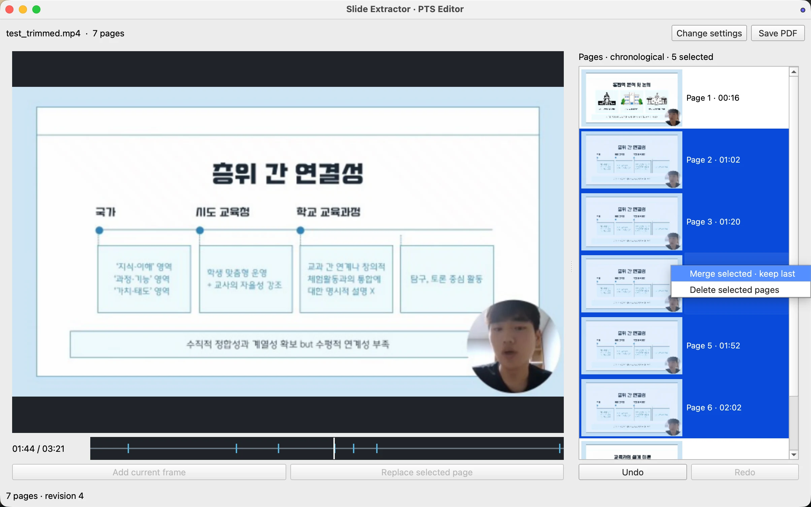

# Slide Extractor 사용법

직접 제작한 발표 영상을 Mac에서 처리한 예시입니다. Windows에서도 같은 순서로 사용하며 창과 버튼 모양은 다를 수 있습니다.

[다운로드·설치 안내](../README.md#다운로드) · [README로 돌아가기](../README.md)

## 1. 영상 열기와 자동 영역 확인

**Open video**를 눌러 추출할 로컬 영상 파일을 선택합니다. 첫 프레임을 기준으로 검은 여백을 제거하는 자동 ROI가 제안됩니다. ROI는 분석하고 PDF로 출력할 슬라이드 영역입니다. 화면이 대부분 검거나 자동 판단이 어려우면 전체 화면을 유지할 수 있으므로 영역을 확인하세요.

## 2. 슬라이드 영역 수동 조절

자동 영역이 맞지 않으면 **Slide ROI**를 누릅니다. 사각형을 이동하거나 테두리의 핸들을 드래그해 크기를 조절하고 **OK**를 누릅니다. 영역 밖에서 드래그하면 새 사각형을 그릴 수 있습니다. **Auto ROI**로 처음 제안된 자동 영역으로 되돌릴 수 있습니다.

설정한 사각형은 영상 전체에 공통으로 적용되며, 미리보기와 PDF도 이 영역으로 잘립니다.

## 3. 변화 감지에서 제외할 영역 지정

웹캠이나 시계처럼 계속 움직이는 부분은 **Ignore mask**에서 사각형으로 지정합니다. 현재는 제외 영역 하나를 지원하며 **Clear mask**로 해제할 수 있습니다.

**이 영역은 변화 감지에서만 제외됩니다. PDF에서 웹캠을 지우거나 가리는 기능은 아닙니다.**

## 4. 분석 결과 확인과 페이지 편집

영역을 확인한 다음 **Analyze**를 누릅니다. 분석이 끝나면 오른쪽 페이지 목록에서 추출된 페이지를 확인하고 아래 타임라인으로 영상의 다른 시점으로 이동합니다.

- **Add current frame:** 현재 프레임을 페이지로 추가합니다.
- **Replace selected page:** 선택한 페이지를 현재 프레임으로 교체합니다.
- **Change settings:** 분석 설정을 다시 조절합니다. 재분석을 적용하면 수동 편집 내용이 초기화될 수 있으니 확인 안내를 읽으세요.

## 5. 여러 페이지 병합·삭제

**첫 페이지 클릭 → Shift + 마지막 페이지 클릭**으로 연속된 페이지를 선택합니다. Windows의 **Ctrl**, Mac의 **Cmd**를 누른 채 클릭하면 개별 선택을 바꿀 수 있습니다. 선택한 페이지 위에서 우클릭합니다.

- **Merge selected · keep last:** 선택한 페이지 중 마지막 시점의 페이지 하나를 남깁니다. 필기가 누적된 페이지들을 정리할 때 사용할 수 있습니다.
- **Delete selected pages:** 선택한 페이지들을 삭제합니다.

선택하지 않은 페이지는 유지됩니다. **Undo / Redo**로 편집을 취소하거나 다시 적용할 수 있습니다.

[페이지 편집 단축키 보기](../README.md#페이지-편집-단축키)

## 6. PDF 저장

페이지를 확인한 뒤 **Save PDF**를 누르고 저장할 위치와 파일 이름을 선택합니다. 기존 파일을 덮어쓸 때는 확인을 요청합니다. 저장이 끝나면 결과 PDF나 저장 폴더를 열 수 있습니다.

빠른 슬라이드 전환은 누락될 수 있고, 필기가 누적되거나 같은 페이지를 재방문하면 중복이 생길 수 있습니다. 저장 전에 결과를 확인하고 추가·병합·삭제로 정리하세요.
